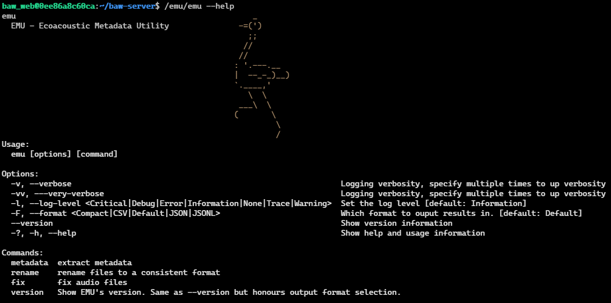
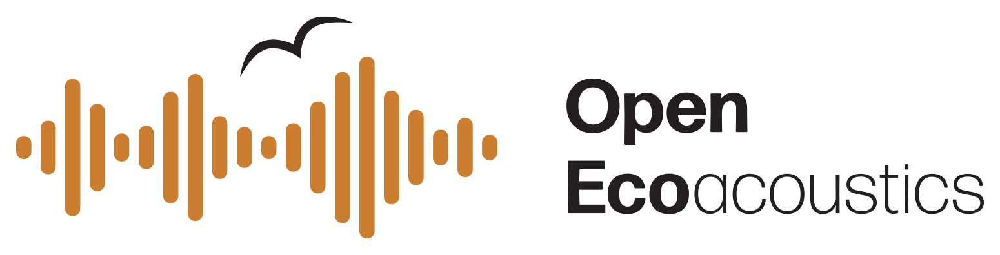

# **EMU**: <small>**E**coacoustics **M**etadata **U**tility</small> 

A generic tool for metadata manipulation of ecoacoustics audio recordings

## But why though?

 

Currently every environmental sensor captures audio recordings and recording metadata in a differant way.

There are efforts underway to standardize this process, but even in a perfect world, there are still plenty of problems to deal with:

-   standards adoption takes time
-   there a millions of recording made using older sensors
-   there a many problems and quirks with existing sensors

## Features

_EMU_ aims to be a babelfish—an adapter—between these formats. _EMU_ can:

-   extract metadata from audio recordings
-   recognize and parse different date stamp formats
-   rename files so that they have a consistent format
-   fix problems in recordings so you can recover and use the data (idempotently)
-   do this in various formats (human friendly, compact, json, json-lines, and csv)
-   and is _fast_ 🔥

## Documentation & Examples

For documentation please look in our [documentation](./docs/) folder!

For example usage, please:

- see [renaming examples](./docs/renaming.md#examples)
- see [metadata extraction examples](./docs/metadata.md#examples)
- see [fixing files examples](./docs/fixes.md#examples)

## Status

EMU has progressed to be a _beta-level_ product.

EMU supports:

- Frontier Labs sensors (for FLAC and WAVE files)
- Wildlife Acoustics sensors (only test for SM4BAT files)
- Open Acoustics devices (only basic WAVE metadata gathering)

We want to support more files and formats. If you need one not covered here, then get in touch!

However, _EMU_ is being actively used in large-scale automated ecoacoustics pipelines to validate and repair faulty audio recordings.

-   EMU runs on Windows, Linux, and Mac\*
-   A docker container is provided (see [Docker](#docker))
-   The metadata extraction is quite good now
-   There are several fixes implemented, but several more are in the backlog

<small>\*EMU needs to be compiled from source on Macs</small>

## Acknowledgements

This project is funded through QUT Ecoacoustics and the [Open Ecoacoustics](https://openecoacoustics.org/) projects

Special thanks also go to Doug Hynes and ECCC for sponsoring the development of the metadata extraction features.

