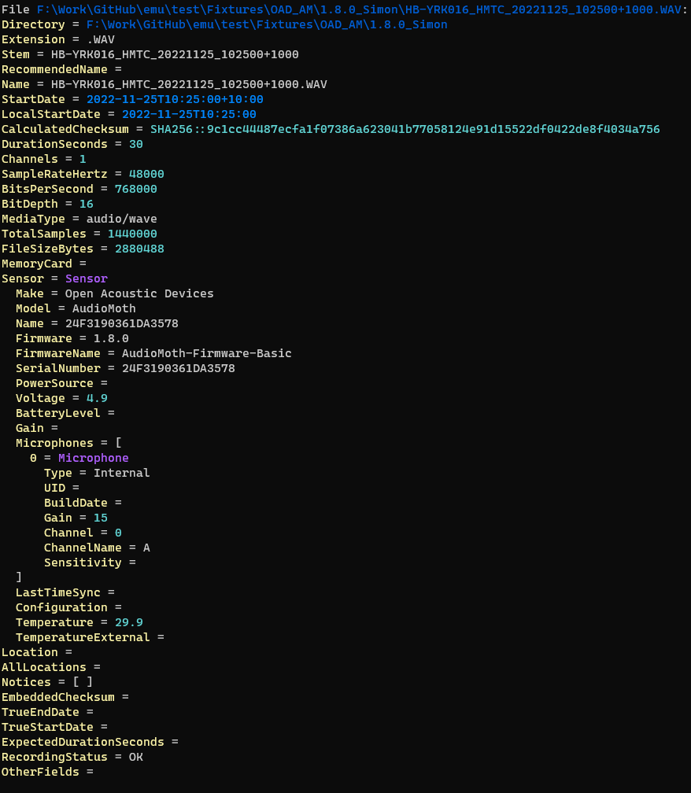
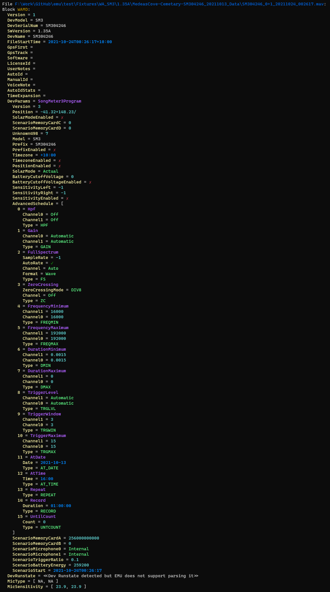
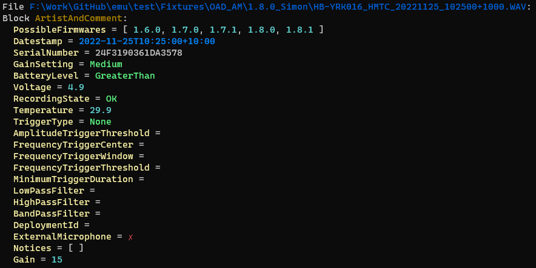

# Metadata

The metadata commands in EMU are focused on manipulating and converting the various
metadata formats that exist.

The `metadata` command shows metadata gathered from audio files
**and** support files, in **one consistent format**. This consistent format is
particularly useful for doing inventories of audio recordings.

The `metadata` command also has these subcommands:

- `show`: an alias for `metadata`
- `dump`: shows metadata from audio file headers only (no support files) in a low-level format
  - `dump` can show you more data but with less consistency - the names and values shown
    are (mostly) chosen by the vendor.
  - Dump currently supports;
    - Frontier Labs FLAC comments
    - Wildlife Acoustics WAMD blocks (and the embedded schedules!)
    - Open Acoustic Devices AudioMoth comments
  - CSV output is not available for `dump` because the output is not consistent enough
<!-- - `split`: splits metadata blocks into sidecar files
- `embed`: embeds metadata blocks into audio files
- `strip`: removes metadata blocks from audio files
- `edit`: edits metadata blocks in audio files -->

The metadata commands (mostly) support all the same formats as out other commands.
See [output](./output.md) for more information.

## Examples

### Show the metadata in a pretty format for the EMU test dataset

```sh
> emu metadata ./test/Fixtures
```

| Sample results:                                 |                                                    |
| ----------------------------------------------- | -------------------------------------------------- |
| **WA SongMeter**                                | **FL BAR**                                         |
|  |  |
| **OAD AudioMoth**                               |                                                    |
|   |                                                    |

### Extract all metadata from all wave files in an external HHD. Save the result into a CSV file

```sh
> emu metadata F:\Data\**\*.wav -F CSV -O metadata.csv
...
```

### Show low-level metadata in pretty format for all audio in the EMU test dataset

```sh
> emu metadata dump ./test/Fixtures
...
```

| Sample results:                                   |                                                       |
| ------------------------------------------------- | ----------------------------------------------------- |
| **WA SongMeter 3**                                | **WA SongMeter 4**                                    |
|       |           |
| **FL BAR**                                        | **OAD AudioMoth**                                     |
|  |  |

## Definitions

- All values are normalized to SI units where possible
  - any duration not explicitly formatted in the sexagesimal format (`HH:mm:ss`) will be in `seconds`
  - data sizes will always be in `bytes`
  - frequency will always be in `hertz`
  - energy will always be in `joules`
- Gain is the amount of amplification applied to the signal. It is measured in dB
  - The sensor can have a global gain setting
  - Each microphone/channel can have a gain setting
- Sensitivity is a calibration value applied to a microphone.
  It allows sample intensity to be converted back to a real physical quantity.
  Sensitivity settings do not affect how a recording is made.
  Sensitivity should be measured in relation to the microphone and sensor.
  Values reported are in dB.

## Supported metadata

Column definitions:

- _Name_: the name of the metadatum
- _`dump`_ and _`show`_ columns: whether or not EMU can extract that metadatum from source material
  - The `dump` column shows if the metadata is supported for the `dump` command
  - The `show` column shows if the metadata is supported for the `show` command
- _Location (s): where a metadatum can be found. Some metadata are stored in multiple locations
  - The _Header_ is any data stored within a file itself. Such metadata do not strictly have to be at the start of the file. 
    e.g. the `wamd` chunk is often located at the end of an audio file
  - The _File_ is any data stored in the file system
  - The _Name_ is any metadata stored in the file's name
  - _Support_ files are additional files produced by the sensor that sit along side the audio recordings
- _Notes_: any extra information about the metadatum
- _Field_: which names we give to the metadatum after extraction
- _Units_: which unit we report the metadatum in after extraction

### FLAC Files

| Name              | `show` | Location(s) | Notes                 | Field | Units   |
| ----------------- | ------ | ----------- | --------------------- | ----- | ------- |
| Sample Rate       | ✔️      | Header      |                       |       | Hertz   |
| Duration          | ✔️      | Header      |                       |       | Seconds |
| Total Samples     | ✔️      | Header      |                       |       |         |
| Channel Count     | ✔️      | Header      |                       |       |         |
| Bit Depth         | ✔️      | Header      |                       |       |         |
| Bits per Second   | ✔️      | Header      |                       |       |         |
| File Size         | ✔️      | File        |                       |       |         |
| Computed Checksum | ✔️      | File        |                       |       |         |
| Embedded Checksum | ✔️      | Header      | MD5 of unencoded data |       |         |

- The embedded checksum is currently not used by Frontier Labs (the only produced of FLAC files we know of). It is always reported as zeroes.

### WAVE Files

| Name              | `show` | Location(s) | Notes | Field | Units   |
| ----------------- | ------ | ----------- | ----- | ----- | ------- |
| Sample Rate       | ✔️      | Header      |       |       | Hertz   |
| Duration          | ✔️      | Header      |       |       | Seconds |
| Total Samples     | ✔️      | Header      |       |       |         |
| Audio Format      | ✔️      | Header      |       |       |         |
| Channel Count     | ✔️      | Header      |       |       |         |
| Byte Rate         | ✔️      | Header      |       |       |         |
| Block Align       | ✔️      | Header      |       |       |         |
| Bit Depth         | ✔️      | Header      |       |       |         |
| Bits per Second   | ✔️      | Header      |       |       |         |
| File Size         | ✔️      | Header      |       |       |         |
| Computed Checksum | ✔️      | File        |       |       |         |


### Frontier Labs

Notes:

 - The datestamps in the file header are more accurate than the filename
   - FL determined that people preferred nice round dates that adhered to sensor schedules rather than properly accurate dates
 - FL do not seem to encode metadata in their WAVE files, only in their FLAC files.
   - Other manufacturers do encode metadata in their WAVE files
     - WA via their `wamd` chunk
     - OAD do it as well

#### BAR-LT

| Name                     | `dump` | `show` | Location(s)           | Notes              | Field         | Units        |
| ------------------------ | ------ | ------ | --------------------- | ------------------ | ------------- | ------------ |
| Date Time                | ✔️      | ✔️      | Name, Header, Support | Reclog             | StartDate     |              |
| RecordingStart           | ✔️      | ✔️      | Header                | First buffer write | TrueStartDate |              |
| RecordingEnd             | ✔️      | ✔️      | Header                | Last buffer write  | TrueEndDate   |              |
| UTC Offset               | ✔️      | ✔️      | Name, Header, Support |                    |               |              |
| Serial Number            | ✔️      | ✔️      | Header, Support       | Log file           |               |              |
| Microphone Type          | ✔️      | ✔️      | Header, Support       | Log file           |               |              |
| Microphone ID            | ✔️      | ✔️      | Header, Name, Support | Log file, Reclog   |               |              |
| Microphone Build Date    | ✔️      | ✔️      | Header, Support       | Log file, Reclog   |               |              |
| Microphone Channel       | ✔️      | ✔️      | Header, Support       | Log file           |               |              |
| Longitude                | ✔️      | ✔️      | Header, Name, Support | GPS_log.csv        |               |              |
| Latitude                 | ✔️      | ✔️      | Header, Name, Support | GPS_log.csv        |               |              |
| Gain                     | ✔️      | ✔️      | Header, Name, Support | Log file, Reclog   |               | dB           |
| Battery Voltage          | ✔️      | ✔️      | Header, Support       | Log file, Reclog   |               |              |
| Card Slot Number         | ❌      | ✔️      | Header, Support       | Log file, Reclog   |               |              |
| Battery Percentage       | ✔️      | ✔️      | Header, Support       | Log file, Reclog   |               |              |
| Device Type              | ❌      | ✔️      | Header, Support       | Log file           |               |              |
| Power Type               | ✔️      | ❌      | Support               | Log file           |               |              |
| Last Time Sync           | ✔️      | ✔️      | Header                |                    |               |              |
| ARU Firmware             | ✔️      | ✔️      | Header, Support       | Log file           |               |              |
| ARU Manufacture Date     | ❌      | ✔️      | Header, Support       | Log file           |               |              |
| SD Capacity (GB)         | ✔️      | ❌      | Support               | Log file, Reclog   |               | bytes        |
| SD Free Space (GB)       | ❌      | ❌      | Support               | Log file, Reclog   |               |              |
| SD Card Serial           | ✔️      | ✔️      | Header, Support       | Log file, Reclog   |               |              |
| SD Card Manufacture Date | ✔️      | ✔️      | Header, Support       | Log file, Reclog   |               |              |
| SD Card Speed            | ✔️      | ❌      | Support               | Log file           |               | bytes/second |
| SD Card Product Name     | ✔️      | ✔️      | Header, Support       | Log file, Reclog   |               |              |
| SD Format Type           | ✔️      | ❌      | Support               | Log file           |               |              |
| SD Card Manufacture ID   | ✔️      | ✔️      | Header, Support       | Log file, Reclog   |               |              |
| SD Card OemID            | ✔️      | ✔️      | Header, Support       | Log file, Reclog   |               |              |
| SD Card Product Revision | ✔️      | ✔️      | Header, Support       | Log file, Reclog   |               |              |
| SD Write Current Vmin    | ✔️      | ❌      | Support               | Log file           |               |              |
| SD Write Current Vmax    | ✔️      | ❌      | Support               | Log file           |               |              |
| SD Write Bl Size         | ✔️      | ❌      | Support               | Log file           |               |              |
| SD Erase Bl Size         | ✔️      | ❌      | Support               | Log file           |               |              |


#### BAR

### Open Acoustic Devices

#### AudioMoth

Firmware support: `1.0.0` through to `1.8.1` (theoretical, need more sample data!).

| Name                      | `dump` | `show` | Location(s)     | Firmware | Notes                       | `show` Field           | Units    |
| ------------------------- | ------ | ------ | --------------- | -------- | --------------------------- | ---------------------- | -------- |
| Date Time                 | ✔️      | ✔️      | Name, Header    | >1.0     |                             | StartDate              |          |
| UTC Offset                | ✔️      | ✔️      | Header          | >1.0     |                             |                        |          |
| Serial Number             | ✔️      | ✔️      | Header          | >1.0     | note 7                      | Sensor.Name            |          |
| Gain Setting              | ✔️      | ✔️      | Header          | >1.0     |                             |                        |          |
| Gain                      | ✔️      | ✔️      | Header          | >1.0     | note 6                      | Sensor.Microphone.Gain | decibels |
| Battery Voltage           | ✔️      | ✔️      | Header          | >1.0,    | note 2                      | Sensor.Voltage         |          |
| Cancel reason             | ✔️      | ✔️      | Header          | >1.2.1   |                             | RecordingStatus        |          |
| Temperature               | ✔️      | ✔️      | Header          | >1.4.0   |                             | Sensor.Temperature     | Celsius  |
| Amplitude Threshold       | ✔️      | ❌      | Header          | >1.4.0   | note 3 & 5                  |                        | ratio    |
| Minimum Trigger Duration  | ✔️      | ❌      | Header          | >1.6.0   | note 5                      |                        | seconds  |
| FrequencyTriggerCenter    | ✔️      | ❌      | Header          | >1.8.0   | note 5                      |                        | Hertz    |
| FrequencyTriggerWindow    | ✔️      | ❌      | Header          | >1.8.0   | note 5                      |                        | samples  |
| FrequencyTriggerThreshold | ✔️      | ❌      | Header          | >1.8.0   | note 5                      |                        | ratio    |
| Low-pass filter           | ✔️      | ❌      | Header          | >1.4.0   | note 5                      |                        | Hertz    |
| High-pass filter          | ✔️      | ❌      | Header          | >1.4.0   | note 5                      |                        | Hertz    |
| Deployment ID             | ✔️      | ✔️      | Header          | >1.5.0   |                             | Sensor.Name            |          |
| External Microphone       | ✔️      | ✔️      | Header          | >1.5.0   |                             |                        |          |
| Location                  | ❌      | ❌      | Support         |          | GPS.TXT, Need sample files! |                        |          |
| Firmware                  | ✔️      | ✔️      | Header, Support |          | **Inferred**, notes 1 & 4   | Sensor.Firmware        |          |

Notes:

1. Firmware version is guessed at via pattern matching the comment string.
   Since the comment string format does not change every version, the firmware version field
   can often report *multiple* possible firmware versions.
2. Low and high battery voltages are inaccurate,
   -  any voltage below the minimum is reported as "less than" and any voltage above the maximum is reported as "greater than"
   -  mins and maxes for various firmwares are as follows:

   | firmware     | min voltage | max voltage |
   | ------------ | ----------- | ----------- |
   | 1.0.0..1.2.0 | 3.6         | 5.0         |
   | 1.2.1..1.3.0 | 3.6         | 4.9         |
   | 1.4.0..      | 2.5         | 4.9         |

3. Prior to firmware 1.6.0 Amplitude threshold was a value in `(0..32768]`.
   After, it could be a decibel value or a percentage. 
   Regardless, **we always report it as a unit interval** (`[0, 1]`).
4. More accurate firmware reporting is possible if a `CONFIG.TXT` file is available near the recordings.
   Only for firmware 1.5.0 and above.
5. These fields have no direct equivalent in our standardized metadata output. 
   They are available via the `metadata dump` command though.
6. There seems to be no definitive source for what decibels gain values represent. We use the following 
   source with the caveat we think it might be unreliable: 
   https://www.openacousticdevices.info/support/main/comment/59c63821-f6d3-37d5-9e16-fccb7829be7d?postId=606f0af298fb4e001508aab8
7. The name of the sensor is it's serial number unless a deployment ID is also set.

AudioMoth support was inspired by [metamoth](https://github.com/mbsantiago/metamoth/) by [@mbsantiago](https://github.com/mbsantiago).

### Wildlife Acoustics

#### Song Meter SM4/SM4BAT/SM3

| Name                     | `dump` | `show` | Location(s)  | Notes                                   | Field                  | Units             |
| ------------------------ | ------ | ------ | ------------ | --------------------------------------- | ---------------------- | ----------------- |
| Date Time                | ✔️      | ✔️      | Name, Header |                                         | LocalStartDate         |                   |
| High Precision Date Time | ✔️      | ✔️      | Name, Header |                                         | StartDate              |                   |
| Sensor Make              | ✔️      | ✔️      | Header       |                                         |                        |                   |
| Sensor Model             | ✔️      | ✔️      | Header       |                                         |                        |                   |
| Sensor Name              | ✔️      | ✔️      | Header       |                                         |                        |                   |
| Firmware                 | ✔️      | ✔️      | Header       |                                         |                        |                   |
| Serial Number            | ✔️      | ✔️      | Header       |                                         |                        |                   |
| Longitude                | ✔️      | ✔️      | Header       |                                         |                        |                   |
| Latitude                 | ✔️      | ✔️      | Header       |                                         |                        |                   |
| Temperature (internal)   | ✔️      | ✔️      | Header       |                                         |                        | °C                |
| Temperature (external)   | ❔      |        | Header       | No test files currently available       |                        | °C                |
| Light                    | ❔      |        | Header       | No test files currently available       |                        | Candela           |
| Humidity                 | ❔      |        | Header       | No test files currently available       |                        | relative humidity |
| Battery Voltage          | ❌      | ❌      | Support      | Summary file, need examples!            |                        |                   |
| WAMD metadata block      | ✔️ish   | ✔️      | Header       | Most fields supported                   |                        |                   |
| Embedded schedule        | ✔️      | ❌      | Header       | The schedule used to program the sensor |                        |                   |
| Microphone Gain          | ✔️      | ✔️      | Header       | See notes                               | Microphone.Gain        | dB                |
| Microphone Sensitivity   | ✔️      | ✔️      | Header       | See notes                               | Microphone.Sensitivity | dB                |

Notes: 

- Microphone gain is determined from the embedded schedule file that was used to create a recording
  - ON SM4s the value is `(Preamp On? ? 26 dB : 0 ) + Gain` per channel
    -  Unless an external microphone is used as the preamp only applies to the internal microphone
  - ON SM3s the value is 
    - the first and only GAIN entry in the schedule (otherwise fail)
    - the value of GAIN entry if specified in dB, or
    - if the GAIN value is set to automatic then the value is 24 dB IFF the microphone is not a hydrophone,
      as per page 36 of the [SM3 manual](https://www.wildlifeacoustics.com/uploads/user-guides/SM3-USER-GUIDE-20200805.pdf).
- All WAMD fields are supported in the dump command (including the sensor's schedule) except for the following fields:
  - `METATAG_DEV_RUNSTATE` - I can't work out the encoding. **If you know what it is, please let me know!**
  - `METATAG_VOICE_NOTE` - currently out of scope for EMU, but could be added if there is demand, has anyone ever used this feature?

#### Song Meter Mini

TODO: Need more example files!

| Name          | Supported | Location(s) | Notes | Field | Units |
| ------------- | --------- | ----------- | ----- | ----- | ----- |
| Serial Number | ❌         | Header      |       |       |       |


#### Song Meter SM2

TODO: Need more example files!

### Cornell Lab

TODO: Need more example files!

#### Swift

TODO: Need more example files!

#### SwiftOne

TODO: Need more example files!