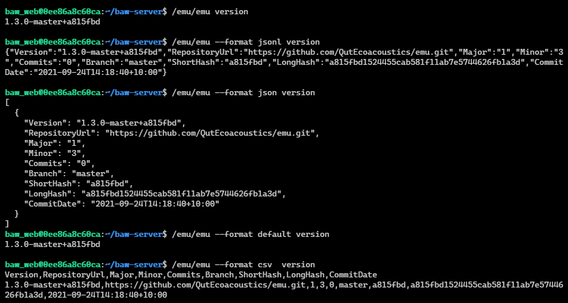

# Output

Emu is designed to be used as part of an automated process - that is why it is a command line tool.

Emu can output results from must of its commands in a format that best suits you:

-   default - a format meant to be easy to read. Will include extra comments, headers, and footers.
-   compact - a single line format for easy use in a shell
-   JSON - the best format for data
-   [JSON Lines](https://jsonlines.org/) - easier to parse line by line records
-   CSV (a great choice for R's data frames, or for viewing in Excel)

