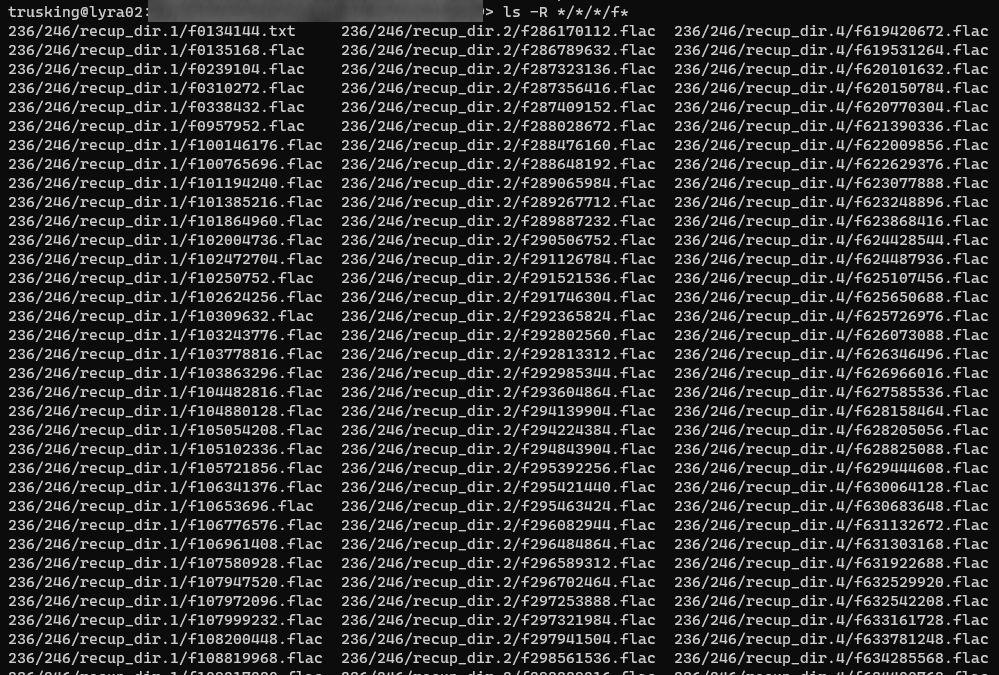

# Renaming

Consistency in filenames is important! Our rename command can make your files 
adhere to standards based naming conventions.

The rename command can pull metadata out from files! This means any information
the [EMU metadata](../docs/metadata.md) has access to, you can whack right into
the filename!

## Templating

EMU will normalize file names with it's standard rename. That is it will keep
largely the same parts in the same order and just remove problematic portions.
See the examples below.

But you can also fully customize the template used for file name using  the `--template` option.
Use any field output by the `metadata` command as a template placeholder.

We recommend using the `--scan-metadata` option to scan the file contents for extra metadata when using a template.

You can mix place holders and literal text. Wrap placeholders in curly braces ({{, }}).
For example, the template  `--template="MyNewName_{StartDate}_{DurationSeconds}{Extension}"`
would rename any files to the format:

- `MyNewName_`
- Then the start date of the file
- `_`
- Then the duration of the audio file (if that tickles your fancy)
- Then the extension of the file.

To see what metadata is available for any given file run the `metadata` command on it first!
See [metadata](./metadata.md).

See below for more examples!

## Safety

The `rename` command has a `--dry-run` option that will simulate the effects of the rename
without actually changing anything. We **strongly** recommend you try every command
first with `--dry-run`.

## Examples

### Rename your files: AudioMoth

Emu will change dates in files to a common and recommended date format where possible.

To rename all AudioMoth files in the current folder and all sub-folders:

```sh
> emu rename **/*.WAV
Looking for targets...
-   Renamed 5B07FAC0.WAV
         to 20180525T120000Z.WAV
1 files, 1 renamed, 0 unchanged, 0 failed
```

### Rename your files: add an offset to a local datestamp

Most acoustic monitors record only a local datestamp - this means the date stamp has no timezone information.
For example a classic SM4 datestamp looks like this: `PILLIGA_20121204_234600.wav`. We can see it was
recorded at 11:46 PM... but is that 11:46 PM UTC time? Eastern Australian Standard Time? Eastern Australian Daylight Savings Time? Something else!?

For small projects adding timezone information won't help a lot. But for any project which spans multiple timezones (
including daylight savings time) we recommend you add this information if your files after you pull them off of your
SD cards:

```sh
> emu rename **/*.wav --offset "+11:00"
Looking for targets...
-   Renamed PILLIGA_20121204_234600.wav
         to PILLIGA_20121204T234600+1100.wav
1 files, 1 renamed, 0 unchanged, 0 failed
```

### Rename your files: Changing the offset

The two dates <date>2021-10-04T20:00:00+00:00</date> and <date>2021-10-05T06:00:00+10:00</date> represent the exact
same instant in time! They're the same... just interpreted differently.

For someone in the UK they experienced that instant as 8 PM. Meanwhile, for someone in Australia, it was 6 AM the next day.

Even though the dates aren't "wrong", it's not useful to try and interpret natural activities in another timezone.
An Australian dawn chorus shouldn't look like it happened at 8 PM (even though it did for that UK observer).

To move all dates to a new UTC offset, use the `--new-offset` argument:

```sh
> emu rename **/*.wav **/*.flac --new-offset "+10:00"
Looking for targets...
-   Renamed 20210617T080000+0000_Rec2_-18.2656+144.5564.flac
         to 20210617T180000+1000_Rec2_-18.2656+144.5564.flac
-   Renamed 20211004T200000+0000_Rec2_-18.1883+144.5414.flac
         to 20211005T060000+1000_Rec2_-18.1883+144.5414.flac
-   Renamed 5B07FAC0.WAV
         to 20180525T220000+1000.WAV
-   Renamed PILLIGA_20121204T234600+1100.wav
         to PILLIGA_20121204T224600+1000.wav
4 files, 4 renamed, 0 unchanged, 0 failed
```


### Rename your files: safety

If you're worried about a rename you can instead create a copy of your files:

```sh
> emu rename **/*.wav --copy-to "G:\RenamedFiles"
...
```

Remember to do a dry-run before operations that modify data!

```sh
> emu rename **/*.wav --copy-to "G:\RenamedFiles" --dry-run
...
```

### Rename your files: flatten

Got too many folders? Flattern the folder hierarchy with:

```sh
> emu rename **/*.wav --flatten
Looking for targets...
-   Renamed WAV\20180525T220000+1000.WAV
         to 20180525T220000+1000.WAV
-   Renamed WAV\PILLIGA_20121204T224600+1000.wav
         to PILLIGA_20121204T224600+1000.wav
4 files, 2 renamed, 2 unchanged, 0 failed
```

### Recovering filenames

Here is a not theoretical scenario: A SD card is corrupted.
The data is still on the card and can be recovered using a file recovery tool.
Unfortunately the recovery process often only recovers the file contents, but not the name of the files!

We experienced this problem and had 2.5K files of useable data that we couldn't process!



Enter EMU! On a smaller demo set of data (including FL and WA files):

```bash
$ ls -l
total 37336
-rwxr--r-- 1 anthony anthony 37195844 Jun  6 16:10 F4622343428908
-rwxr--r-- 1 anthony anthony  1030730 Mar 28 14:46 F4623864286243

$ emu rename --template "{StartDate}{Extension}" --scan-metadata **/F*
Looking for targets...
-   Renamed /mnt/f/tmp/fixes/renames/F4622343428908
         to /mnt/f/tmp/fixes/renames/20220331T094902-0300.flac
-   Renamed /mnt/f/tmp/fixes/renames/F4623864286243
         to /mnt/f/tmp/fixes/renames/20210621T205706-0300.wav
2 files, 2 renamed, 0 unchanged, 0 failed

$ ls -l
total 37336
-rwxr--r-- 1 anthony anthony  1030730 Mar 28 14:46 20210621T205706-0300.wav
-rwxr--r-- 1 anthony anthony 37195844 Jun  6 16:10 20220331T094902-0300.flac
```


The command finds each file in any sub-folder that has the name `F*` 
(`F` followed by any number of any characters),
scan the metadata from _inside_ the files, and then gives each file a 
new name consisting of the start date of the recording followed by it's extension.

### Including a file's sample rate in the file name

Maybe you need to filter files by their quality?

```
$ ls -l
total 37336
-rwxr--r-- 1 anthony anthony  1030730 Mar 28 14:46 20210621T205706-0300.wav
-rwxr--r-- 1 anthony anthony 37195844 Jun  6 16:10 20220331T094902-0300.flac

$ emu rename --template "{StartDate}_{SampleRateHertz}{Extension}" --scan-metadata --dry-run
Looking for targets...
-   Renamed /mnt/f/tmp/fixes/renames/20210621T205706-0300.wav
         to /mnt/f/tmp/fixes/renames/20210621T205706-0300_256000.wav
-   Renamed /mnt/f/tmp/fixes/renames/20220331T094902-0300.flac
         to /mnt/f/tmp/fixes/renames/20220331T094902-0300_44100.flac

$ ls -l
total 37336
-rwxr--r-- 1 anthony anthony  1030730 Mar 28 14:46 20210621T205706-0300_256000.wav
-rwxr--r-- 1 anthony anthony 37195844 Jun  6 16:10 20220331T094902-0300_44100.flac
```

That'd do the trick. Not sure why you would want to, but you could...

### Including a sensor's serial number

OK that last example was a bit silly! Let's fix it!

```
$ ls -l
total 37336
-rwxr--r-- 1 anthony anthony  1030730 Mar 28 14:46 20210621T205706-0300_256000.wav
-rwxr--r-- 1 anthony anthony 37195844 Jun  6 16:10 20220331T094902-0300_44100.flac

> emu rename --template "{Sensor.SerialNumber}_{StartDate}{Extension}" --scan-metadata
Looking for targets...
-   Renamed /mnt/f/tmp/fixes/renames/20210621T205706-0300_256000.wav
         to /mnt/f/tmp/fixes/renames/S4U09523_20210621T205706-0300.wav
-   Renamed /mnt/f/tmp/fixes/renames/20220331T094902-0300_44100.flac
         to /mnt/f/tmp/fixes/renames/00008570_20220331T094902-0300.flac
2 files, 2 renamed, 0 unchanged, 0 failed

 ls -l
total 37336
-rwxr--r-- 1 anthony anthony 37195844 Jun  6 16:10 00008570_20220331T094902-0300.flac
-rwxr--r-- 1 anthony anthony  1030730 Mar 28 14:46 S4U09523_20210621T205706-0300.wav
```

Cool 😎.